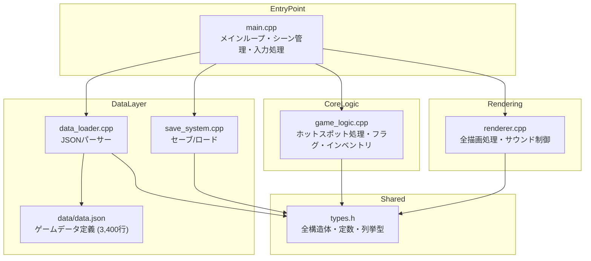
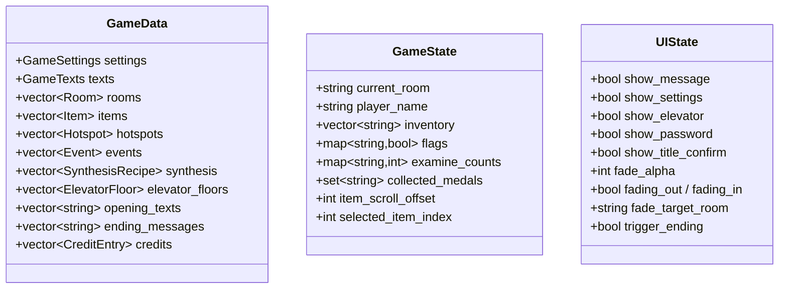
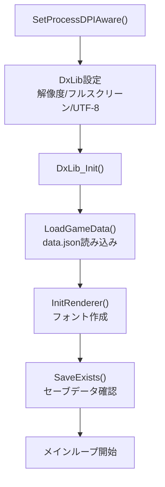
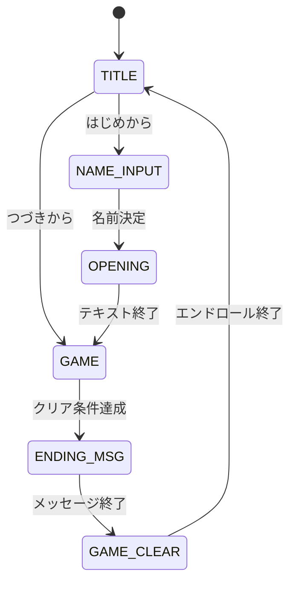
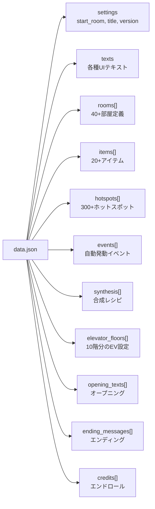

### OFFICE ESCAPE — コード技術解説書

> **ジャンル**: ポイント＆クリック型 脱出ゲーム  
> **言語**: C++17  
> **フレームワーク**: DXライブラリ (DxLib)  
> **ビルドシステム**: CMake + Visual Studio 2022  
> **配布方式**: Inno Setup によるインストーラ  
> **解像度**: 1920×1080 フルスクリーン

---

### 1. プロジェクト概要

10階建てオフィスビルからの脱出を目指すポイント＆クリック型アドベンチャーゲーム。プレイヤーは深夜のオフィスで目を覚まし、各フロアを探索してアイテムを集め、パズルを解きながら屋上のヘリポートから脱出する。

### ゲームの主な要素
- **40以上の部屋**を持つ10階建てビルの探索
- **20種以上のアイテム**（鍵、道具、合成素材など）の収集と使用
- **パスワード入力**・**アイテム合成**・**エレベーター移動**などの多彩なギミック
- **フラグベースのストーリー進行**管理
- **コレクション要素**（10枚の隠しメダル）
- **セーブ/ロード**システム

---

### 2. アーキテクチャ全体図



### モジュール間の依存関係

| モジュール | 依存先 | 役割 |
|---|---|---|
| `main.cpp` | 全モジュール | アプリケーション制御の中枢 |
| `game_logic.cpp` | `types.h` | ゲームルールの実装 |
| `renderer.cpp` | `types.h`, DxLib | 描画・サウンド |
| `data_loader.cpp` | `types.h`, nlohmann/json | データ読み込み |
| `save_system.cpp` | `types.h`, nlohmann/json | 永続化 |
| `types.h` | (なし) | 共有データ定義 |

---

### 3. ファイル構成と行数

### ソースコード

| ファイル | 行数 | サイズ | 概要 |
|---|---|---|---|
| [main.cpp](file:///c:/office/src/main.cpp) | 1,145行 | 58KB | メインループ・シーン管理・入力処理 |
| [renderer.cpp](file:///c:/office/src/renderer.cpp) | 1,450行 | 70KB | 全UI描画・背景・エフェクト・サウンド |
| [game_logic.cpp](file:///c:/office/src/game_logic.cpp) | 589行 | 28KB | ホットスポット処理・インベントリ・合成 |
| [data_loader.cpp](file:///c:/office/src/data_loader.cpp) | 268行 | 13KB | JSONデータの構造体マッピング |
| [save_system.cpp](file:///c:/office/src/save_system.cpp) | 201行 | 8KB | セーブ/ロードのシリアライズ |
| [types.h](file:///c:/office/src/types.h) | 333行 | 14KB | 全データ構造体・定数・UI座標 |
| [renderer.h](file:///c:/office/src/renderer.h) | 78行 | 4KB | 描画/サウンドAPI宣言 |
| [game_logic.h](file:///c:/office/src/game_logic.h) | 35行 | 2KB | ゲームロジックAPI宣言 |
| **合計** | **約4,100行** | **約197KB** | |

### データファイル

| ファイル | 行数 | 概要 |
|---|---|---|
| [data/data.json](file:///c:/office/data/data.json) | 3,400行 | 部屋・アイテム・ホットスポット・イベント定義 |

### アセット

| ディレクトリ | ファイル数 | 概要 |
|---|---|---|
| `assets/backgrounds/` | 約40ファイル | 各部屋の背景画像 (PNG) |
| `assets/items/` | 約30ファイル | アイテムアイコン (PNG) |
| `assets/ui/` | 約25ファイル | UIパーツ画像 (PNG) |
| `assets/sounds/` | 約15ファイル | BGM・SE (WAV) |

---

### 4. 各モジュール詳細解説

### 4.1 types.h — 共有データ定義

ゲーム全体で使用されるデータ構造体、UI座標定数、色定義、シーン列挙型を一元管理するヘッダーファイル。

### 主要データ構造体



### 設計ポイント
- **`GameData`**: JSONから読み込まれる**不変のマスターデータ**。ゲーム中に変更されない
- **`GameState`**: プレイヤーの**進行状態**。セーブ/ロード対象
- **`UIState`**: 画面表示の**一時的な状態**。セーブ対象外
- 3つの構造体を明確に分離することで、セーブ対象の管理を簡潔にしている

### [Hotspot構造体](file:///c:/office/src/types.h#L131-L171) の設計

ホットスポットはゲームの中核的なデータ構造であり、6種類のインタラクションタイプを単一の構造体で表現する：

| タイプ | 用途 | 使用フィールド |
|---|---|---|
| `examine` | オブジェクトを調べる | `message`, `give_item`, `give_medal`, `examine_count` |
| `move` | 別の部屋に移動する | `move_to`, `require_item`, `message_locked` |
| `use_item` | アイテムを使用する | `require_item`, `require_item_b`, `give_item` |
| `elevator` | エレベーターを呼ぶ | (UIパネル表示のみ) |
| `synthesis` | アイテムを合成する | (SynthesisRecipeと連携) |
| `password` | パスワードを入力する | `password_answer`, `message_wrong` |

---

### 4.2 main.cpp — メインループとシーン管理

[main.cpp](file:///c:/office/src/main.cpp) はアプリケーションのエントリーポイント（`WinMain`）であり、以下を担当する。

### 初期化フロー



### シーン遷移



### 入力処理の設計

```cpp
// シングルクリック検出（長押し防止）
bool clicked = (!mouse_pressed && prev_pressed); // 「離した瞬間」のみ反応
```

クリック判定は**マウスボタンを離した瞬間**のみ有効とし、押し続けても連続クリックが発生しない設計。

### フェードシステム

部屋移動時のフェードアウト→フェードインをステートマシンで制御：

```
ChangeRoom呼び出し → fading_out=true
→ 毎フレーム fade_alpha += FADE_SPEED (8)
→ fade_alpha=255到達 → current_room変更 → fading_in=true
→ 毎フレーム fade_alpha -= FADE_SPEED
→ fade_alpha=0到達 → フェード完了 → CheckRoomEvents実行
```

---

### 4.3 game_logic.cpp — ゲームロジック

[game_logic.cpp](file:///c:/office/src/game_logic.cpp) はゲームのルール・ロジックを実装する。描画やI/Oに一切依存しない純粋なロジック層。

### ProcessHotspot — ゲームの中核関数

[ProcessHotspot](file:///c:/office/src/game_logic.cpp#L180-L455) は約280行の関数で、ホットスポットのタイプに応じた分岐処理を行う。

````carousel
**examine タイプ（調査）**
```
1. メダル取得チェック（重複なし）
2. フラグ済みなら事後メッセージを返す（重複取得防止）
3. 探索回数制限がある場合：
   - N回未満 → 回数別メッセージを返す
   - N回到達 → アイテム付与・フラグセット
4. 通常調査（制限なし）：
   - 初回のみアイテム付与（自動フラグ生成で管理）
   - フラグセット後は通常メッセージのみ
```
<!-- slide -->
**move タイプ（移動）**
```
1. 鍵が必要な場合：
   - 鍵未所持 → ロックメッセージ
   - 初回開錠 → 鍵消費(consumableの場合) + フラグセット
   - 開錠済み → そのまま移動
2. ChangeRoom(フェード付き部屋移動)を呼び出し
```
<!-- slide -->
**use_item タイプ（アイテム使用）**
```
1. フラグ済み → 事後メッセージ
2. 必要アイテムチェック（最大2つ）
   - 不足時は「2種類必要」のヒント付きメッセージ
3. consumableアイテムの消費
4. アイテム付与・フラグセット
5. エンディング判定
```
<!-- slide -->
**synthesis タイプ（合成）**
```
1. 合成済みチェック（フラグ）
2. SynthesisRecipeからレシピ検索
3. 素材A + 素材Bの所持確認
   - 両方所持 → 素材消費 → 結果アイテム付与
   - 不足 → 「2つの素材が必要」ヒント付き失敗メッセージ
```
````

### フラグシステム

ゲーム進行は `std::map<std::string, bool>` によるフラグで管理される。フラグ名は自由な文字列で、データ駆動型の設計により、コード変更なしに `data.json` の編集だけでゲームの進行条件を変更可能。

```
例: "elevator_active" → エレベーター使用可能
    "found_key_cafeteria" → 社員食堂の鍵発見済み
    "synthesized_replica_seal" → 偽造印鑑の合成完了
```

---

### 4.4 renderer.cpp — 描画・サウンド処理

[renderer.cpp](file:///c:/office/src/renderer.cpp) はゲームの全描画処理とサウンド制御を担う最大のファイル（約1,450行）。

### リソース管理（キャッシュシステム）

4種類の静的 `std::map` でリソースハンドルをキャッシュし、同じファイルの再読み込みを防止：

| キャッシュ | 対象 | パス規則 |
|---|---|---|
| `s_bg_cache` | 背景画像 | `assets/backgrounds/bg_{room_id}.png` |
| `s_icon_cache` | アイテムアイコン | `assets/items/{item_id}.png` |
| `s_ui_cache` | UI画像 | `assets/ui/{name}.png` |
| `s_sound_cache` | BGM・SE | `assets/sounds/{name}.wav` |

**フォールバック設計**: 画像ファイルが存在しない場合でもクラッシュせず、プログラム的に描画される代替表示（色付き矩形＋テキスト）が自動的に使用される。

### 描画関数一覧

| 関数 | 行数 | 概要 |
|---|---|---|
| `DrawBackground` | ~35行 | 背景画像描画（フォールバック付き） |
| `DrawUIPanel` | ~115行 | 右側UIパネル（アイテム欄・ツールチップ） |
| `DrawHotspotOverlays` | ~170行 | ホットスポットのクリッカブルUI表示 |
| `DrawMessageWindow` | ~45行 | 画面下部メッセージウィンドウ |
| `DrawSettingsPanel` | ~80行 | 設定パネル（音量調整） |
| `DrawElevatorPanel` | ~55行 | エレベーター選択パネル |
| `DrawPasswordPanel` | ~30行 | パスワード入力パネル |
| `DrawTitleScreen` | ~85行 | タイトル画面 |
| `DrawNameInputScreen` | ~70行 | 名前入力画面（IME対応） |
| `DrawCreditsRoll` | ~65行 | エンドロール（メダル収集結果付き） |
| `DrawMedalCounter` | ~30行 | メダル収集状況表示 |
| `DrawFade` | ~10行 | フェードエフェクト |

### ツールチップのUTF-8自動折り返し

アイテム説明文が長い場合にパネル内に収めるため、UTF-8のマルチバイト文字を正しく処理しながら1文字ずつピクセル幅を計測して自動改行する処理を実装：

```cpp
// UTF-8の先頭バイトからバイト長を判定
unsigned char c = (unsigned char)paragraph[pos];
int char_len = 1;
if (c >= 0xF0) char_len = 4;      // 4バイト文字（絵文字等）
else if (c >= 0xE0) char_len = 3;  // 3バイト文字（日本語）
else if (c >= 0xC0) char_len = 2;  // 2バイト文字

// 幅超過時に改行
int test_w = GetDrawStringWidthToHandle(test_line.c_str(), ...);
if (test_w > max_text_w && !current_line.empty()) {
    DrawStringToHandle(...);  // 現在行を描画
    current_line = next_char; // 新しい行を開始
}
```

---

### 4.5 data_loader.cpp — JSONデータ読み込み

[data_loader.cpp](file:///c:/office/src/data_loader.cpp) は `nlohmann/json` ライブラリを使用して `data.json` を読み込み、C++の構造体にマッピングする。

### 設計方針
- 全フィールドに **デフォルト値** を設定（`.value("key", default)`）し、JSONにキーが存在しなくてもクラッシュしない
- 読み込み完了後にデバッグコンソールに統計情報を出力
- **データ駆動設計**: 部屋の追加、アイテムの追加、ホットスポットの配置変更などは全て `data.json` の編集だけで行える

---

### 4.6 save_system.cpp — セーブ/ロードシステム

[save_system.cpp](file:///c:/office/src/save_system.cpp) は `GameState` と `AppSettings` を `savedata/save.json` にシリアライズ/デシリアライズする。

### 保存対象データ

| カテゴリ | フィールド | 型 |
|---|---|---|
| 進行状態 | `current_room` | string |
| | `player_name` | string |
| | `inventory` | string[] |
| | `flags` | {string: bool} |
| | `examine_counts` | {string: int} |
| | `collected_medals` | string[] |
| 設定 | `fullscreen` | bool |
| | `bgm_volume` / `se_volume` | int (0-255) |

### パス解決
実行ファイルのあるディレクトリを `GetModuleFileNameA` で取得し、カレントディレクトリに依存しない堅牢なパス解決を行う。

---

### 5. data.json の構造

ゲームの全コンテンツは [data.json](file:///c:/office/data/data.json)（約3,400行）に定義されている。



---

### 6. 技術的なハイライト

### 6.1 データ駆動設計
ゲームコンテンツ（部屋、アイテム、パズル、メッセージ）は全て `data.json` で定義。コード変更なしにゲーム内容を拡張・修正できる。

### 6.2 堅牢なフォールバック
画像・音声ファイルが存在しない場合もクラッシュせず、プログラム的にUIを生成。開発初期段階でもゲームをプレイ可能。

### 6.3 フラグベースの進行管理
`std::map<string, bool>` による柔軟なフラグシステムで、イベントの発動条件・アイテム出現条件・ドアの開錠状態を管理。

### 6.4 UTF-8完全対応
DxLibの文字コード設定（`DX_CHARCODEFORMAT_UTF8`）、ソースコードのUTF-8コンパイル（`/utf-8`）、テキスト描画時のUTF-8バイト長判定による正確な文字列処理。

### 6.5 リソースキャッシュ
4種類の `static std::map` によるリソースハンドルキャッシュで、同一リソースの重複読み込みを防止。失敗時（`-1`）もキャッシュに記録して無駄な再試行を回避。

### 6.6 シーンベースのゲームフロー
`enum Scene` と `switch` 文による明確なシーン管理。各シーンは独立して入力処理と描画を行い、`g_current_scene` の変更だけでシーン遷移が完了する。

---

### 7. ビルド環境

| 項目 | 詳細 |
|---|---|
| **コンパイラ** | MSVC (Visual Studio 2022) |
| **C++バージョン** | C++17 |
| **ビルドシステム** | CMake 3.20+ |
| **グラフィックス** | DXライブラリ (DirectX 11ベース) |
| **JSONライブラリ** | nlohmann/json (ヘッダーオンリー) |
| **インストーラ** | Inno Setup 6 |
| **ターゲットOS** | Windows 10/11 (x64) |

### ビルド手順
```bash
mkdir build && cd build
cmake .. -G "Visual Studio 17 2022" -A x64
cmake --build . --config Release
```

---

### 8. ディレクトリ構造

```
office/
├── src/                    # ソースコード
│   ├── main.cpp            # エントリーポイント・メインループ
│   ├── game_logic.cpp/h    # ゲームロジック
│   ├── renderer.cpp/h      # 描画・サウンド
│   ├── data_loader.cpp/h   # JSONデータ読み込み
│   ├── save_system.cpp/h   # セーブ/ロード
│   ├── types.h             # 全構造体・定数定義
│   └── resource.rc         # Windowsリソース（アイコン）
├── data/
│   └── data.json           # ゲームデータ定義
├── assets/
│   ├── backgrounds/        # 部屋背景画像
│   ├── items/              # アイテムアイコン
│   ├── ui/                 # UIパーツ画像
│   └── sounds/             # BGM・効果音
├── include/
│   └── nlohmann/json.hpp   # JSONライブラリ
├── DxLib/                  # DXライブラリ
├── CMakeLists.txt          # ビルド設定
└── installer.iss           # インストーラ設定
```

### 9. 注意
ダウンロードする際、ブラウザで警告が出ますが、そのままダウンロードしてください。
